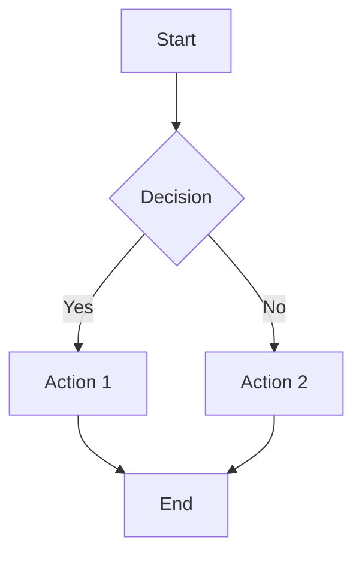
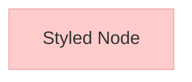
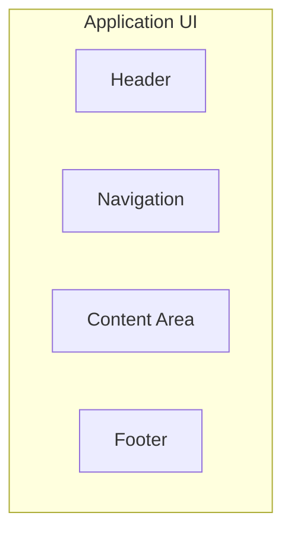
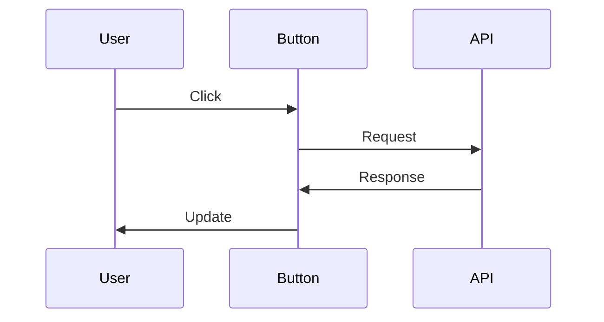
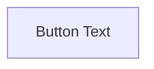

# Syntax Research: Markdown-Based UI Design Solutions

**Date:** November 6, 2025
**Purpose:** Analysis of existing text-based UI wireframing solutions to inform wiremd syntax design
**Phase:** Phase 1 - Syntax Definition

## Executive Summary

This document analyzes five existing approaches to creating UI wireframes and mockups using text-based syntax:

1. **Markdown-UI** - Ruby gem for building Semantic-UI components with markdown
2. **Balsamiq Text Mode** - Text shortcuts and formatting within a visual wireframe tool
3. **ASCII Diagrams** - Traditional box-drawing characters and conventions
4. **PlantUML Salt** - Dedicated GUI mockup sublanguage within PlantUML
5. **Mermaid** - Diagramming tool with potential (but currently no native wireframe support)

### Key Findings Summary

| Solution | Markdown Native? | UI Focused? | Active? | Best For | Limitations |
|----------|------------------|-------------|---------|----------|-------------|
| Markdown-UI | ✓ | ✓ | Limited | Component library binding | Ruby-only, Semantic-UI coupled |
| Balsamiq Text | Partial | ✓ | ✓ | Quick text entry | Not standalone, proprietary |
| ASCII Diagrams | ✗ | Partial | ✓ | Documentation, simple layouts | Manual box drawing, not semantic |
| PlantUML Salt | ✗ | ✓ | ✓ | Technical mockups | Non-markdown syntax, complex |
| Mermaid | ✗ | ✗ | ✓ | Diagrams | No wireframe support |

---

## 1. Markdown-UI

### Overview
**Repository:** https://github.com/jjuliano/markdown-ui
**License:** MIT
**Language:** Ruby
**Stars:** ~204
**Status:** Active but limited updates

Markdown-UI is a Ruby gem that converts markdown syntax into HTML using the Semantic-UI framework.

### Syntax Patterns

#### Basic Button
```markdown
# __Button|A Button__
```
Renders to:
```html
<button class="ui button">A Button</button>
```

#### Syntax Components
- `#` prefix indicates component type
- `__` delimiters wrap component definition
- `|` separates component type from content
- Relies on heading levels for component hierarchy

### Technical Architecture
- **Parser:** RedCarpet (Ruby markdown library)
- **UI Framework:** Semantic-UI (tightly coupled)
- **Output:** HTML with Semantic-UI classes
- **Interactive REPL:** markdown-ui-shell for live testing

### Strengths
✓ Feels like natural markdown
✓ Simple, minimal syntax
✓ Interactive shell for experimentation
✓ MIT licensed
✓ Clear component-to-markup mapping

### Weaknesses
✗ Ruby ecosystem only (no JavaScript/Node.js)
✗ Tightly coupled to Semantic-UI
✗ Limited component library
✗ No layout system
✗ Parsing issues with colon (`:`) characters
✗ Block elements require special handling
✗ Minimal documentation

### Insights for wiremd
- **Adopt:** Using markdown heading syntax for component hierarchy
- **Adapt:** The delimiter pattern but make it more flexible
- **Avoid:** Tight coupling to specific UI frameworks
- **Consider:** REPL/interactive mode for development

---

## 2. Balsamiq Text Mode

### Overview
**Product:** Balsamiq Wireframes
**Type:** Commercial wireframing tool with text syntax shortcuts
**Status:** Active, widely used
**Focus:** Rapid wireframing for product design

Balsamiq is primarily a visual tool, but includes extensive text-based shortcuts for quick content entry and control definition.

### Syntax Patterns

#### Text Formatting
```
*bold text*           → Bold
_italic text_         → Italic
-disabled text-       → Grayed out/disabled appearance
```

#### Control-Specific Syntax

**Menu/List Items:**
```
*Processing*\r_Auto Klub_-, -\-$23.79- :chevron-right-solid:
```
- `\r` creates line breaks
- `,` creates tabs/columns
- `:icon-name:` inserts icons
- `-` wrapper indicates disabled state

**Common Controls:**
- Buttons: `[Button Text]`
- Links: `Link Text`
- Radio: `( ) Option` or `(x) Selected`
- Checkbox: `[ ] Unchecked` or `[x] Checked`
- Dropdown: `[Dropdown v]`
- Tabs: `Tab1, Tab2, Tab3`

#### Special Characters
- `,` → Tab separator in controls
- `\r` → Line break within controls
- `:icon-name:` → Icon insertion
- `*`, `-`, `_` → Formatting

### Technical Architecture
- Primarily visual/drag-and-drop tool
- Text syntax enhances speed of content entry
- Custom rendering engine for "sketchy" appearance
- Proprietary format (.bmpr files)

### Strengths
✓ Extremely fast for experienced users
✓ Intuitive shortcuts
✓ Extensive icon library
✓ Rich control library
✓ Well-documented
✓ Production-tested with large user base

### Weaknesses
✗ Not markdown-based
✗ Not standalone text format
✗ Proprietary/commercial
✗ Requires GUI application
✗ Not version-control friendly
✗ No pure-text workflow

### Insights for wiremd
- **Adopt:** Icon syntax pattern (`:icon-name:`)
- **Adopt:** Simple inline formatting (`*bold*`, `_italic_`)
- **Adapt:** Control syntax patterns but make them more markdown-like
- **Learn:** Balsamiq's shortcuts are intuitive because they visually resemble the output
- **Consider:** How to represent disabled/loading/error states

---

## 3. ASCII Diagram Conventions

### Overview
**Type:** General convention, not a specific tool
**History:** Decades of use in documentation and code comments
**Tools:** ASCIIFlow, Diagon, Monodraw, DrawIt (Vim), JavE
**Status:** Widely used, especially in technical documentation

ASCII diagrams use box-drawing characters and text layout to create visual representations.

### Syntax Patterns

#### Basic Box Drawing

**Single Line:**
```
┌─────────────┐
│   Content   │
└─────────────┘
```

**Double Line:**
```
╔═════════════╗
║   Content   ║
╚═════════════╝
```

**Mixed Styles:**
```
╔══════════════╗
║ Header       ║
╠══════════════╣
│ Body Content │
├──────────────┤
│ Footer       │
└──────────────┘
```

#### UI Mockup Example
```
┌────────────────────────────────────┐
│ Logo        Home  Products  Login  │
├────────────────────────────────────┤
│                                    │
│  ┌──────────────────────────────┐ │
│  │                              │ │
│  │      Welcome to Product      │ │
│  │   [Get Started]  [Learn]    │ │
│  │                              │ │
│  └──────────────────────────────┘ │
│                                    │
│  ┌────────┐ ┌────────┐ ┌────────┐│
│  │Feature │ │Feature │ │Feature ││
│  │  One   │ │  Two   │ │ Three  ││
│  └────────┘ └────────┘ └────────┘│
└────────────────────────────────────┘
```

#### Unicode Box Drawing Characters

**Corners:**
- `┌ ┐ └ ┘` (single)
- `╔ ╗ ╚ ╝` (double)
- `╭ ╮ ╰ ╯` (rounded)

**Lines:**
- `─ │` (single)
- `═ ║` (double)
- `┄ ┆` (dashed)

**Intersections:**
- `├ ┤ ┬ ┴ ┼` (single)
- `╠ ╣ ╦ ╩ ╬` (double)

### Tools & Ecosystem

**ASCIIFlow (asciiflow.com):**
- Web-based drawing tool
- Freeform drawing with mouse
- Export to text
- Infinite canvas
- Google Drive integration

**Diagon (arthursonzogni.com/Diagon/):**
- Multiple diagram generators
- Tree, table, flowchart, sequence diagrams
- Text input → ASCII art output

**Research Dataset:**
A study cataloged 2,156 ASCII diagrams from major codebases (Chromium, Linux, LLVM, TensorFlow) showing widespread real-world usage.

### Strengths
✓ Universal - works anywhere text works
✓ Version control friendly
✓ No special tools required
✓ Decades of established conventions
✓ Great for technical documentation
✓ Immediately visible in plain text

### Weaknesses
✗ Manual and tedious to create
✗ Difficult to maintain/update
✗ No semantic meaning (just visual)
✗ Not parseable for code generation
✗ Alignment issues with proportional fonts
✗ Limited expressiveness
✗ Not responsive or dynamic

### Insights for wiremd
- **Learn:** The visual clarity of box-drawing is powerful for readability
- **Avoid:** Manual box-drawing is too tedious for modern workflows
- **Consider:** Could generate ASCII output as a rendering option
- **Note:** Good for documentation but not practical as primary input format
- **Insight:** Shows strong demand for text-based UI representation

---

## 4. PlantUML Salt

### Overview
**Project:** PlantUML subproject
**URL:** https://plantuml.com/salt
**Purpose:** "Software Architecture Layout Tool" - GUI wireframing
**License:** GPL/LGPL
**Status:** Actively maintained

Salt is a specialized syntax within PlantUML specifically designed for creating GUI mockups and wireframes.

### Syntax Patterns

#### Basic Structure
```
@startsalt
{
  Login Form
  User name | "username   "
  Password  | "****       "
  [OK] | [Cancel]
}
@endsalt
```

#### UI Elements Reference

**Buttons:**
```
[Button Text]
```

**Radio Buttons:**
```
(X) Selected option
( ) Unselected option
```

**Checkboxes:**
```
[X] Checked item
[ ] Unchecked item
```

**Text Input:**
```
"text input    "
```

**Textarea (with scrollbar):**
```
{SI
Multiple line
text area
}
```

**Dropdown/Combobox:**
```
^Dropdown List^
```

#### Layout System - Tables

Salt uses tables (with `|` separators) for layout:

```
@startsalt
{
  Column 1 | Column 2 | Column 3
  Data A   | Data B   | Data C
  [Button] | "input " | ^dropdown^
}
@endsalt
```

**Table Modifiers:**
- `{` - standard table with borders
- `{!` - table with bold header
- `{-` - table without borders
- `{+` - table with outer solid lines
- `{#` - special formatting

**Empty Cell:**
```
. | Content | .
```

#### Tabs
```
@startsalt
{+
  {/ Tab 1 | **Tab 2** | Tab 3
    Contents of Tab 2
  }
}
@endsalt
```
- `{/` starts tabs
- `**` indicates selected tab

#### Trees
```
@startsalt
{+
{T+
 + Root
 ++ Branch 1
 +++ Leaf 1
 +++ Leaf 2
 ++ Branch 2
}
}
@endsalt
```
- `{T+` starts tree
- `+` levels indicate hierarchy

#### Separators
```
--    (dashed line)
..    (dotted line)
==    (double line)
~~    (wavy line)
```

#### Styling
```
<color:red>Red text</color>
<#FF0000>Colored background</color>
<size:18>Large text</size>
```

#### Icons and Images
```
<&folder>                  Icon reference
<<folder>>                 ASCII art placeholder
```

### Complex Example
```
@startsalt
{+
  {* File | Edit | View | Help }
  {/ General | Specific | Debug }
  {
    Name          | "John Doe        "
    Email         | "john@example.com" {type:email}
    Status        | ^Active^
    {
      [X] Notifications
      [ ] Newsletter
      (X) Email
      ( ) SMS
    }
    {SI
      Additional
      comments here
    }
  }
  [ OK ] | [ Cancel ]
}
@endsalt
```

### Technical Architecture
- Part of PlantUML ecosystem
- Generates PNG, SVG, or ASCII output
- Java-based rendering engine
- Can be embedded in documentation tools
- Integrates with Confluence, GitLab, GitHub, etc.

### Strengths
✓ Dedicated UI mockup syntax
✓ Comprehensive component library
✓ Powerful layout system
✓ Active maintenance
✓ Production-ready
✓ Good documentation
✓ Multiple output formats
✓ Wide tool integration
✓ Handles complex layouts

### Weaknesses
✗ Not markdown-based at all
✗ Custom syntax is learning curve
✗ Verbose for simple layouts
✗ Table-based layout can be confusing
✗ Bracket nesting gets complex
✗ Not as intuitive as markdown
✗ Java dependency
✗ Mixing metaphors (tables for layout)

### Insights for wiremd
- **Learn:** Comprehensive approach to UI elements
- **Learn:** Clear syntax patterns for form controls
- **Adopt:** Icon syntax pattern (`<&icon>`)
- **Adapt:** Component syntax but make it more markdown-like
- **Avoid:** Table-based layout system (too verbose)
- **Avoid:** Heavy bracket nesting
- **Consider:** Similar tab syntax pattern
- **Note:** Shows dedicated UI syntax is viable and wanted

---

## 5. Mermaid

### Overview
**Project:** Mermaid.js
**URL:** https://mermaid.js.org
**Type:** Markdown-inspired diagramming and charting
**License:** MIT
**Status:** Very active, widely adopted

Mermaid is a JavaScript-based diagramming tool that uses markdown-like syntax to create various diagram types.

### Current Capabilities

#### Supported Diagram Types
- Flowcharts
- Sequence diagrams
- Class diagrams
- State diagrams
- Entity Relationship diagrams
- User Journey diagrams
- Gantt charts
- Pie charts
- Git graphs
- C4 architecture diagrams
- Mindmaps
- Timelines

#### Basic Syntax Example (Flowchart)


#### Styling


Mermaid supports multiple visual themes including:
- Default
- Forest
- Dark
- Neutral
- Hand-drawn

### UI Wireframe Support Status

**As of 2025:** NO NATIVE WIREFRAME SUPPORT

There is an open GitHub issue (#1184) from 2020 requesting wireframe capabilities similar to PlantUML's Salt syntax. The request has significant community interest but has not been implemented.

Users have mentioned creating "nice wireframes" using Mermaid, but this involves creative use of flowcharts and other diagram types, not dedicated wireframe syntax.

### Workaround Approaches

Users have attempted to create UI representations using:

**Flowchart Boxes:**


**Sequence Diagrams for Interactions:**


### Technical Architecture
- JavaScript/TypeScript
- Runs in browser or Node.js
- Extensive plugin ecosystem
- Integration with major documentation platforms
- Live editor at mermaid.live

### Strengths
✓ Markdown-like syntax
✓ Very active development
✓ Large community
✓ MIT licensed
✓ Excellent documentation
✓ Wide tool adoption
✓ Multiple output formats
✓ Beautiful default styling
✓ Hand-drawn theme option
✓ Browser and Node.js support

### Weaknesses (for wireframing)
✗ No wireframe support
✗ Not designed for UI mockups
✗ Workarounds are awkward
✗ Can't represent form controls
✗ No component library concept

### Insights for wiremd
- **Learn:** Mermaid's syntax style is widely loved
- **Learn:** The `graph` keyword pattern for declaring diagram types
- **Learn:** Styling approach with theme variables
- **Opportunity:** Clear demand for wireframe syntax in this space
- **Consider:** Mermaid-compatible syntax as a stretch goal
- **Insight:** Hand-drawn theme shows appetite for sketch-like wireframes
- **Note:** If wiremd succeeds, could potentially integrate with Mermaid

---

## Comparative Analysis

### Syntax Philosophy Comparison

| Solution | Philosophy | Learning Curve | Markdown Fidelity |
|----------|------------|----------------|-------------------|
| Markdown-UI | Extend markdown with delimiters | Low | High - feels like markdown |
| Balsamiq | Text shortcuts for speed | Low | None - not markdown |
| ASCII | Visual drawing | Medium | None - pure ASCII art |
| PlantUML Salt | Custom structured language | Medium-High | None - custom syntax |
| Mermaid | Markdown-inspired declarations | Low-Medium | High - similar to markdown |

### Component Definition Approaches

**Markdown-UI:** Prefix-based
```markdown
# __Button|Click Me__
```

**Balsamiq:** Visual representation
```
[Button Text]
```

**PlantUML Salt:** Wrapped syntax
```
[Button Text]
```

**ASCII:** Manual drawing
```
┌─────────┐
│ Button  │
└─────────┘
```

**Mermaid:** Node-based


### Layout Strategy Comparison

| Solution | Layout Strategy | Pros | Cons |
|----------|----------------|------|------|
| Markdown-UI | None (relies on UI framework) | Simple | No layout control |
| Balsamiq | Visual drag-and-drop | Intuitive | Not text-based |
| ASCII | Manual positioning | Full control | Tedious, not semantic |
| PlantUML Salt | Table-based grid | Structured | Verbose, confusing |
| Mermaid | Graph relationships | Flexible | Not for UI layout |

---

## Key Insights for wiremd

### What Works Well

1. **Markdown-like syntax is highly desired**
   - Both Markdown-UI and Mermaid show high adoption
   - Low learning curve
   - Feels natural to developers

2. **Visual similarity to output helps**
   - Balsamiq's `[Button]` looks like a button
   - ASCII boxes visually represent layout
   - Intuitive syntax reduces cognitive load

3. **Component libraries are essential**
   - All mature solutions have extensive component sets
   - Need buttons, inputs, selects, checkboxes, radios, etc.

4. **Layout is the hard problem**
   - ASCII requires manual positioning
   - Salt uses confusing table metaphor
   - No solution has elegant text-based layout syntax

5. **Styling/theming matters**
   - Mermaid's themes are popular
   - Balsamiq's sketch style is iconic
   - Users want visual polish options

6. **Icons need special syntax**
   - Balsamiq: `:icon-name:`
   - Salt: `<&icon>`
   - Clear pattern: some delimiter around icon names

7. **State representation is needed**
   - Disabled, active, loading, error states
   - Current solutions handle this poorly
   - Opportunity for wiremd to excel here

### What to Avoid

1. **Tight framework coupling** (Markdown-UI mistake)
2. **Requiring GUI tools** (Balsamiq limitation)
3. **Manual visual drawing** (ASCII problem)
4. **Tables for layout** (Salt's confusing choice)
5. **Heavy bracket nesting** (Salt's complexity issue)
6. **Non-markdown syntax** (Salt, ASCII)
7. **Proprietary formats** (Balsamiq)

### Opportunities

1. **Gap in market:** No modern, markdown-native UI wireframe tool
2. **Mermaid integration:** Potential to fill requested feature
3. **Developer workflow:** Version control friendly format
4. **Progressive enhancement:** Markdown fallback behavior
5. **Modern CSS:** Can leverage Grid/Flexbox unlike older tools
6. **State representation:** Better syntax than existing tools

---

## Recommendations for wiremd Syntax

Based on this research, here are specific recommendations:

### 1. Core Philosophy
- **Markdown-first:** Valid markdown should render reasonably even without parser
- **Progressive enhancement:** Add features via attributes, not new syntax
- **Visual similarity:** Syntax should hint at visual output
- **Simplicity over completeness:** Start minimal, add features iteratively

### 2. Component Syntax

**Learn from Balsamiq's visual patterns:**
```markdown
[Button Text]
[Input Field___]
( ) Radio Option
[x] Checked Checkbox
```

**Enhanced with attributes (learn from HTML/Mermaid):**
```markdown
[Sign In]{.primary}
[Email___]{type:email required}
```

### 3. Layout Syntax

**Avoid Salt's table approach. Consider:**

Option A - Container blocks:
```markdown
::: grid-3
![Feature 1]
![Feature 2]
![Feature 3]
:::
```

Option B - Markdown list patterns:
```markdown
## Grid Layout
- Feature 1
- Feature 2
- Feature 3
{.grid-3}
```

Option C - Semantic HTML-like:
```markdown
## Features {.grid-3}

### Feature One
Content here

### Feature Two
Content here
```

### 4. Icons

**Adopt colon pattern (common in Slack, GitHub, Balsamiq):**
```markdown
:magnifying-glass: Search
:user: Profile
:gear: Settings
```

### 5. State Representation

**New approach - state modifiers:**
```markdown
[Submit]{:disabled}
[Loading...]{:loading}
[Error message]{:error}
![Empty state]{:empty}
```

### 6. Navigation Patterns

**Special syntax for common patterns:**
```markdown
[[ Logo | Home | Products | About | [Sign In] ]]
```
Compact representation of navigation bars.

### 7. Form Handling

**Markdown-friendly form syntax:**
```markdown
## Contact Form

[Name___]{required}
[Email___]{type:email required}
[Phone___]{type:tel}
[Message...]{rows:5}
[Submit]
```

---

## Implementation Priority

Based on this research, suggested implementation order:

### Phase 1 (MVP)
1. Basic containers (sections, headers, footers)
2. Buttons with states
3. Text content (headings, paragraphs)
4. Simple layout (single column)

### Phase 2
1. Form inputs (text, email, textarea)
2. Checkboxes and radio buttons
3. Grid layout system
4. Basic styling attributes

### Phase 3
1. Navigation components
2. Icons
3. Images with placeholder support
4. Cards and modals

### Phase 4
1. Tables
2. Complex nested layouts
3. State representations
4. Advanced form elements (select, multi-select)

---

## Conclusion

The research reveals significant demand for text-based UI wireframing but no ideal solution exists. Current tools have these issues:

- **Markdown-UI:** Good idea, poor execution, framework-locked
- **Balsamiq:** Not standalone, proprietary, requires GUI
- **ASCII:** Too manual, not semantic
- **PlantUML Salt:** Powerful but non-markdown, complex syntax
- **Mermaid:** Wrong use case (but beloved syntax style)

**wiremd has a clear opportunity** to be the first modern, markdown-native, framework-agnostic UI wireframing tool that combines:
- Markdown familiarity (like Markdown-UI and Mermaid)
- Component completeness (like Salt and Balsamiq)
- Text-only workflow (like ASCII and Salt)
- Modern output (like Mermaid's themes)
- Open source and extensible (MIT license)

The syntax should prioritize:
1. Feeling like markdown
2. Visual similarity to output
3. Minimal learning curve
4. Progressive enhancement
5. Framework independence

This positions wiremd uniquely in the market with no direct competitor offering this combination of features.

---

## References

### Tools & Projects
- Markdown-UI: https://github.com/jjuliano/markdown-ui
- Balsamiq: https://balsamiq.com
- ASCIIFlow: https://asciiflow.com
- Diagon: https://arthursonzogni.com/Diagon
- PlantUML Salt: https://plantuml.com/salt
- Mermaid: https://mermaid.js.org

### Documentation
- PlantUML Salt Cheat Sheet: https://gist.github.com/wonderstory/31b8b32a2843f3475398a377c41aee52
- ASCII Diagrams Dataset: https://asciidiagrams.github.io
- Mermaid Wireframe Feature Request: https://github.com/mermaid-js/mermaid/issues/1184

### Articles
- Creating UX with Markdown: https://dev.to/gochev/creating-ux-with-textmarkdown-2mm
- Balsamiq Documentation: https://balsamiq.com/wireframes/desktop/docs/

---

**Document Status:** Complete
**Next Steps:** Review syntax options in project plan (section 1.2) and make decisions on specific syntax patterns
**Last Updated:** November 6, 2025
